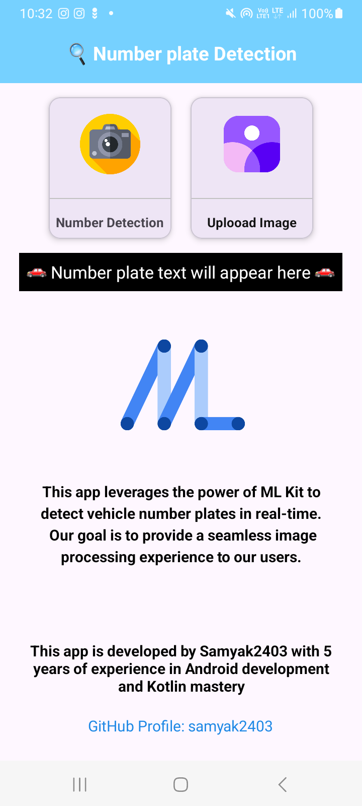
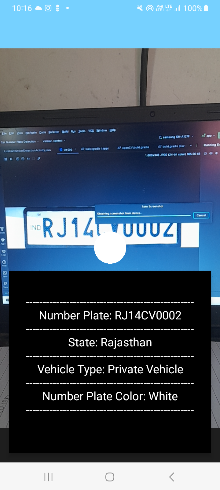
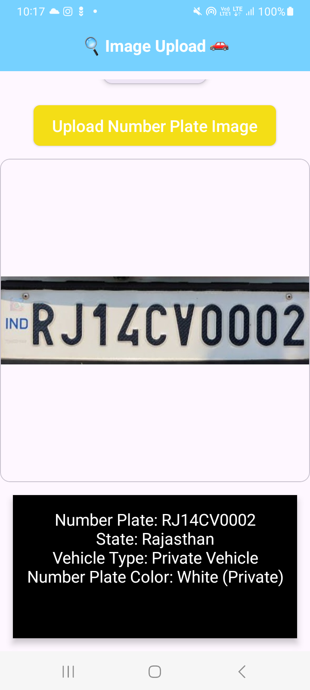

# 🚗 Car/Bike Number Plate Detection App 📱

Welcome to the **Car/Bike Number Plate Detection App**, an Android application that leverages machine learning to detect and recognize Indian vehicle number plates in real-time using your device's camera. 🚘📸

Not only does it extract the number plate information, but it also provides additional details like the **state of registration**, **vehicle type**, and **number plate color**. All of this is optimized for Indian number plates with a specific two-row format (e.g., "KA41 ER4547"). 🇮🇳

## ✨ Features

- **Real-Time Detection**: Detect vehicle number plates in real-time using your device's camera. 🕒
- **Advanced Text Recognition**: Utilizes Google ML Kit's powerful text recognition capabilities for accurate extraction. 🔍
- **State & Vehicle Type Identification**: Automatically identifies the vehicle's state, type (private, commercial, bike), and plate color. 🛣️
- **Optimized for Indian Plates**: Specifically designed to work with Indian number plates in the format "KA41 ER4547". 🇮🇳

## 🛠️ Technologies Used

- **Java**: Core programming language for Android development. ☕
- **Google ML Kit**: For real-time text recognition and OCR (Optical Character Recognition). 🤖
- **Android CameraX**: Modern camera framework for capturing and analyzing images. 📷

## 📋 Requirements

- **Android Studio 4.1 or higher**
- **Minimum SDK version**: 21 (Android 5.0 Lollipop)
- **Google ML Kit dependencies** for text recognition

## 🚀 Getting Started

Follow these instructions to get a copy of the project up and running on your local machine.

### 🔧 Setup Instructions

1. **Clone the Repository**:

   ```bash
   git clone https://github.com/samyak2403/CarNumberPlateDetection.git
   ```

# Live Car Number Detection

## Open the Project in Android Studio

1. Launch Android Studio.
2. Navigate to `File > Open`.
3. Select the cloned project directory.

## Install Dependencies

Ensure the following dependencies are included in your `app/build.gradle` file:

```groovy
implementation 'com.google.mlkit:text-recognition:16.0.0'
implementation 'androidx.camera:camera-core:1.0.0'
implementation 'androidx.camera:camera-camera2:1.0.0'
implementation 'androidx.camera:camera-lifecycle:1.0.0'
```

# LiveCarNumberDetection 🚗🔍

## 📱 Build and Run the Project:

1. **Connect your Android device or start an emulator** with a working camera.
2. Click on `Run > Run 'app'`.
3. **Grant Permissions**:
   - When prompted, grant the app permission to access the device's camera. 📹

## 📖 Usage

1. **Launch the App**:
   - Open the app on your Android device.

2. **Point the Camera**:
   - Aim your camera at a vehicle number plate in the format `KA41 ER4547`. 🏍️

3. **View Results**:
   - The app will display the detected number plate along with vehicle information on the screen. 📄

## 🧐 How It Works

1. **Text Recognition**:
   - Uses Google ML Kit to perform optical character recognition (OCR) on live camera frames to detect text. 📝

2. **Number Plate Parsing**:
   - The app is optimized for number plates with the following format:
     - **First Row**: Two letters (state code) followed by two digits (RTO code), e.g., "KA41".
     - **Second Row**: Two letters (series) followed by four digits (unique number), e.g., "ER4547".

3. **Information Extraction**:
   - **State Identification**: Maps the state code to the state name (e.g., "KA" -> "Karnataka").
   - **Vehicle Type Determination**: Analyzes the plate color and format to determine if it's a private vehicle, commercial vehicle, or bike.
   - **Number Plate Color**: Identifies the color of the number plate to infer the type of registration (e.g., white for private vehicles, yellow for commercial). 🎨

## 📊 Example Output

```yaml
Number Plate: KA41 ER4547
State: Karnataka
Vehicle Type: Private Vehicle
Number Plate Color: White
```


## Screenshots


  |   | 
 |  

 

## 🤝 Contributing
Contributions are welcome! Please fork the repository and submit a pull request. For major changes, please open an issue first to discuss what you would like to change. 🛠️

## 📝 License
This project is licensed under the MIT License. 📄

## 📞 Contact
For any inquiries or support, please contact [samyak kamble](arrowwouldpro.com). 📧

## 🙏 Acknowledgments
- Google ML Kit Team for providing the powerful text recognition API.
- Android Developers Community for their invaluable resources and support.
- Open Source Contributors who have helped improve this project.

